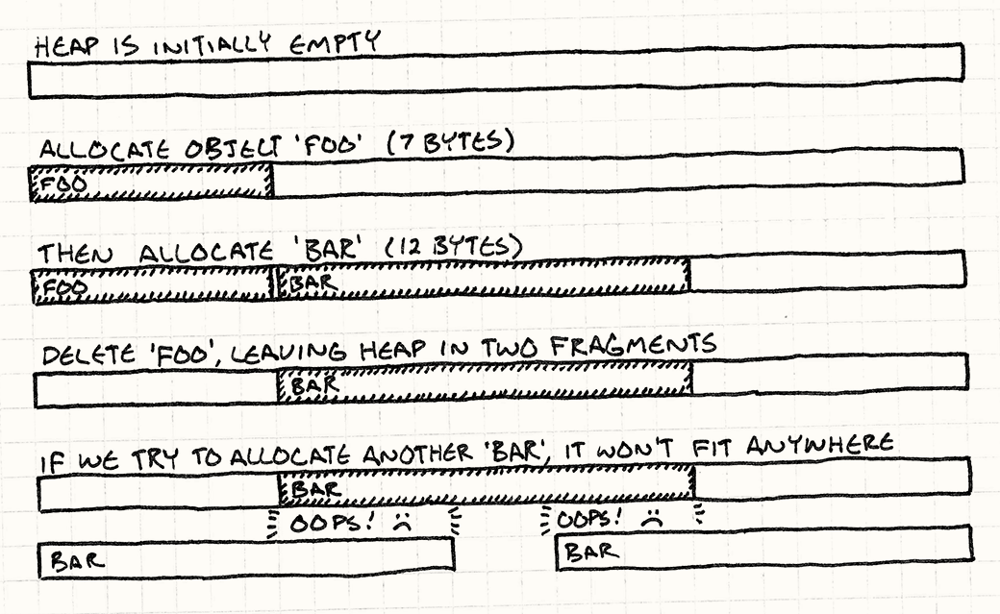

## 메모리 단편화

메모리 단편화는 아래와 같은 사진처럼 발생합니다.



(출처: https://gameprogrammingpatterns.com/object-pool.html)

전체 메모리 공간은 많지만, 조각난 메모리때문에 연속된 메모리 중 할당하려는 크기가 없게 됩니다.
즉, 메모리 단편화는 메모리 공간을 효율적으로 사용하지 못해 발생하고 이를 방지하기 위해
메모리 관리 전략(스마트 포인터, 메모리 풀 등)과 메모리 압축 등이 필요합니다.

Jvm 진영의 개발을 할 때도 느꼈지만, 불필요한 객체의 생성이 정말 많습니다. 가령 문자열 리터럴로 생성되는 String 객체처럼요! (물론 String 풀로 관리된다고 알고 있습니다!)

물론! 하드웨어의 발달로 메모리를 여유롭게 사용하고, 객체의 불변성 보장을 위해 사용하는 것은 좋은 방향이라고 생각합니다!

## Object Pool

프로그래밍에서 pool은 Thread Pool에서만 들어봤는데, Object Pool은 이름만 봐도 비슷한 역할이라고 생각됩니다.
단편화와 연결해 생각해보면, 큰 메모리를 미리 할당받고 그 내부에서 객체를 생성해 사용한다면 해당 객체의 생성, 삭제에 관해서는 메모리 단편화가 방지될 것 입니다.

코드로 확인해봅시다.

```cpp
class Particle
{
public:
  Particle()
  : framesLeft_(0)
  {}

  void init(double x, double y,
            double xVel, double yVel, int lifetime)
  {
    x_ = x; y_ = y;
    xVel_ = xVel; yVel_ = yVel;
    framesLeft_ = lifetime;
  }

  void animate()
  {
    if (!inUse()) return;

    framesLeft_--;
    x_ += xVel_;
    y_ += yVel_;
  }

  bool inUse() const { return framesLeft_ > 0; }

private:
  int framesLeft_;
  double x_, y_;
  double xVel_, yVel_;
};
```

위와 같은 Particle 클래스가 있습니다. `framesLeft_` 는 0으로 초기화 후 init()에서 시작되고, animate() 함수를 통해 객체의 상태변화가 발생합니다.

```cpp
class ParticlePool
{
public:
  void create(double x, double y,
              double xVel, double yVel, int lifetime);

  void animate()
  {
    for (int i = 0; i < POOL_SIZE; i++)
    {
      particles_[i].animate();
    }
  }

private:
  static const int POOL_SIZE = 100;
  Particle particles_[POOL_SIZE];
};

void ParticlePool::create(double x, double y,
                          double xVel, double yVel,
                          int lifetime)
{
  // Find an available particle.
  for (int i = 0; i < POOL_SIZE; i++)
  {
    if (!particles_[i].inUse())
    {
      particles_[i].init(x, y, xVel, yVel, lifetime);
      return;
    }
  }
}
```

위와 같이 Pool을 구현할 수 있습니다. array를 통해 가용 가능한 particle을 찾는 로직은, 연결리스트와 같이 변경하여 수정할 수 있습니다.

아래는 template 프로그래밍으로 구현한 Object pool의 일부입니다. ([출처](https://koreanfoodie.me/1261))

```cpp
template<typename Type>
class ObjectPool
{
public:
	template<typename... Args>
	static Type* Pop(Args&&... args)
	{
		Type* memory = static_cast<Type*>(MemoryHeader::AttachHeader(s_pool.Pop(), s_allocSize));
		new(memory)Type(forward<Args>(args)...); // placement new
		return memory;
	}

	static void Push(Type* obj)
	{
		obj->~Type();
		s_pool.Push(MemoryHeader::DetachHeader(obj));
	}

	static shared_ptr<Type> MakeShared()
	{
		shared_ptr<Type> ptr = { Pop(), Push };
		return ptr;
	}

private:
	static int32		s_allocSize;
	static MemoryPool	s_pool;
};

template<typename Type>
int32 ObjectPool<Type>::s_allocSize = sizeof(Type) + sizeof(MemoryHeader);

template<typename Type>
MemoryPool ObjectPool<Type>::s_pool{ s_allocSize };
```

Object Pool을 사용하면 메모리 문제가 모두 해결되는 것은 아닙니다.

- pool은 결국 사용하지 않는 메모리는 놀고 있는 메모리가 됩니다.
- 코드 복잡도가 올라갑니다.
- 이 패턴은 객체 생성 소멸이 빈번한 경우에 적합합니다!

코드 작성을 해보지 못하고, 다소 빈약하게 조사해서 아쉽지만!!
프로젝트를 진행하며 Object Pool을 구현하여 사용해 본 후, 더 보충해보겠습니다!